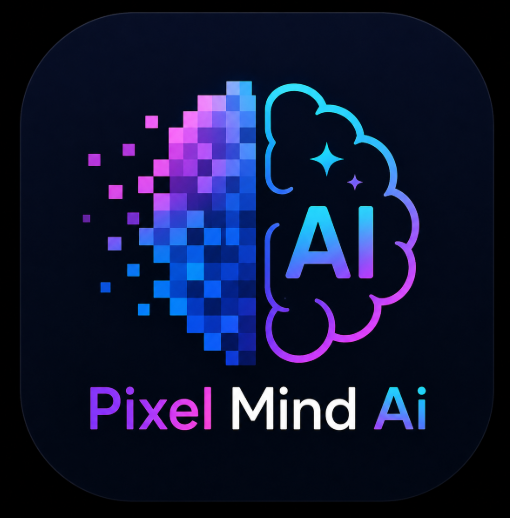

<a href="https://www.blinkshot.io">
  
  <h1 align="center">PixelMind AI</h1>
</a>

  An open source free AI image generator. Powered by Pollinations.ai.

## Features

1. **Text on Image**: Add custom text, font styles, position, and colors directly onto your generated images.
2. **Random Prompt Generator**: Not sure what to generate? Click the dice button to get a highly detailed creative prompt instantly.
3. **Aspect Ratio Selector**: Generate images in various formats like Square (1:1), Landscape (16:9), Portrait (9:16), Standard (4:3), and Classic Portrait (3:4).
4. **Prompt Enhancer**: Use Groq AI to magically enhance simple prompts into highly descriptive, professional prompts.
5. **Image Style Presets**: Choose from numerous predefined artistic styles (Anime, Cyberpunk, Watercolor, Pixel Art, etc.) to apply to your generation.

## Tech stack

- [Pollinations.ai](https://pollinations.ai) for free image generation
- Next.js app router with Tailwind
- Groq AI for prompt enhancement
- Helicone for observability
- Plausible for website analytics

## Cloning & running

1. Clone the repo: `git clone https://github.com/Nutlope/blinkshot`
2. Set `GROQ_API_KEY` in `.env.local` to enable the Prompt Enhancer
3. No API key is required for image generation with Pollinations.ai
4. Run `npm install` and `npm run dev` to install dependencies and run locally

## Future Tasks

- [ ] Show a download button so people can get their images
- [ ] Add auth and rate limit by email instead of IP
- [ ] Show people how many credits they have left
- [ ] Build an image gallery of cool generations w/ their prompts
- [ ] Add replay functionality so people can replay consistent generations
- [ ] Add a setting to select between steps (2-5)
